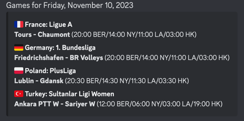

# Serve

Get the schedule your favourite volleyball leagues straight to your discord channel of choice.

The outcome looks as such:



## Deployment

```bash
brew install flyctl

flyctl auth login

fly launch

# set env variables
fly secrets set API_KEY=<flashscore-api-key>                                                                                                                        
fly secrets set DISCORD_URI=<full-discord-uri>

# creating the db
fly volume create servevolume -r ams -n 1
fly secrets set DSN=sqlite3:///mnt/servevolume/serve.sqlite 
fly secrets list

# see: https://community.fly.io/t/scp-a-file-into-a-persistent-volume/2729
# put the output into prod/private_key.pem
flyctl ssh issue --agent
fly ssh console -C 'mkdir /data/'  
scp prod/private_key.pem root@serve.internal:/data/private_key.pem
sqlite3 serve.db #exit with .quit
scp serve.db root@serve.internal:/data/serve.db

# get the current state of the db
fly ssh console -a serve -C 'ls -l /data/'
flyctl ssh -a serve sftp get /data/serve.db \
  && flyctl ssh -a serve sftp get /data/serve.db-shm \
  && flyctl ssh -a serve sftp get /data/serve.db-wal

# run only one container to execute CRON only once
fly scale count 1

# update running app
fly deploy
```

## Testing

There's a skipped test in `discord/discord_test.go` if you want to check that the discord message gets properly.
formatted

## TODOs

- use `"NAME_PART_1"` & `"NAME_PART_2"` from flashscore response for country/league struct
- do ping on DB on startup
- Add Emojis to high set scores